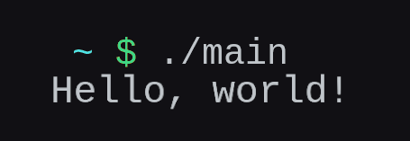

<h1 align="center">csv</h1>
<p align="center">
	<a href="./LICENSE">
		
	</a>
	<a href="https://github.com/LordOfTrident/csv/issues">
		
	</a>
	<a href="https://github.com/LordOfTrident/csv/pulls">
		
	</a>
	
	<br><br><br>
</p>

A simple single-header [STB-style](https://github.com/nothings/stb) stringview library for C.

## Table of contents
* [Simple example](#simple-example)
* [Quickstart](#quickstart)
* [Bugs](#bugs)

## Simple example
```c
#include <stdio.h> /* printf */

#define CSV_IMPLEMENTATION
#include "csv.h"

int main(void) {
	sv_t sv = sv_cstr("aabaacbaHelloabacb");
	sv = sv_trim(sv, "abc");

	printf(SV_FMT", world!\n", SV_ARG(sv));
	return 0;
}
```
Output



## Quickstart
Copy [`csv.h`](./csv.h) into your project and include it.
[See the examples](./examples).

To compile and run the examples, run
```sh
$ cc ./examples/trim.c -o trim
$ cc ./examples/find.c -o find
$ ./trim
$ ./find
```

## Bugs
If you find any bugs, please create an issue and report them.
